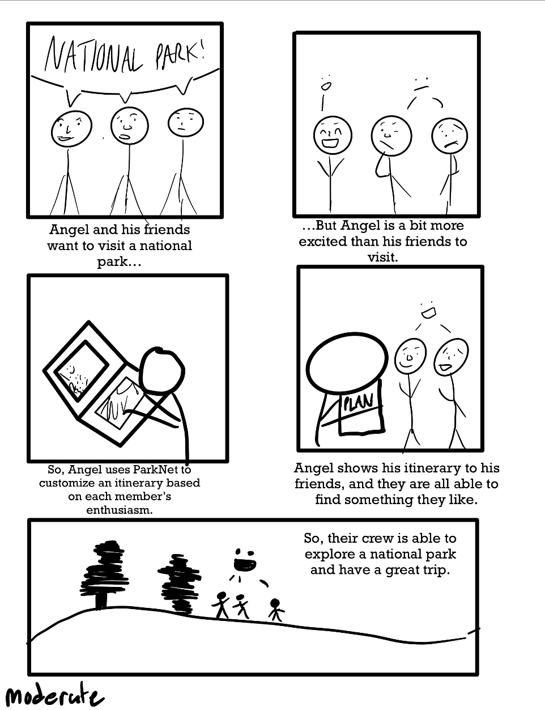
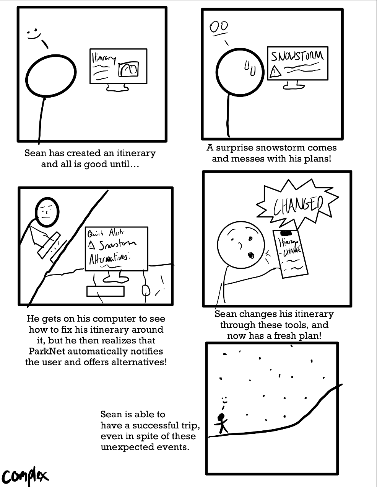

# parkNet
## National Park Explorer: Your Guide to the Great Outdoors

## Welcome to the National Park Explorer Project!

## About the Project
National Park Explorer is a web-based platform designed to help outdoor enthusiasts and casual travelers alike discover and plan trips to national parks in the United States. Leveraging user-centric design and comprehensive research, our tool personalizes travel suggestions, itineraries, and prepares you for an unforgettable adventure.

### Storyboards
The storyboard illustrate how National Park Explorer addresses users' needs through three levels of tasks:

1. **Personal Recommendations:**  

2. **Accommodate Multiple Members' Preference:**  

3. **Quick Updates & Alternate Planning:**  

These scenarios showcase the flexibility and depth of the platform, catering to diverse user interests from adventure and photography to conservation and education.

---

**Links to Mid-Fi Prototype:**  
Links for FIGMA

File link: https://www.figma.com/file/oNaaxsFSEinmCI9s8PNs30/Home?type=design&node-id=0%3A1&mode=design&t=VOVILSfL12lzS4fZ-1
 
Figma preview: https://www.figma.com/proto/oNaaxsFSEinmCI9s8PNs30/Home?type=design&node-id=1-2&t=VOVILSfL12lzS4fZ-0&scaling=min-zoom&page-id=0%3A1 

Let's discover the great outdoors together!